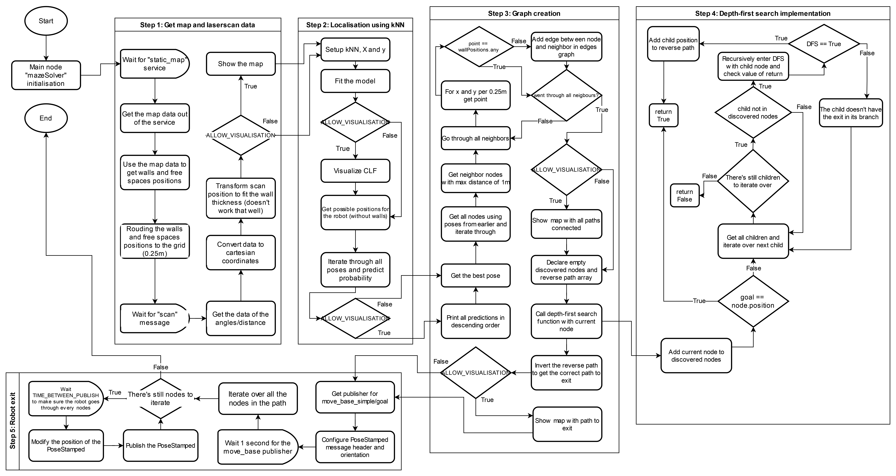

# Maze Escape Robot Documentation
## Overview
The goal of this project is to develop ROS scripts in order to make an "autonomous" maze-solving robot. The robot is equipped with a laser scanner and utilizes a combination of map processing, machine learning-based localization, and search algorithms to navigate through the maze and reach the exit.

## Project Structure
The project consists of the following main files:

- mazeSolver.py: The main Python script responsible for solving the maze. It uses ROS messages for laser scan data, map information, and pose data. The script performs map processing, k-nearest neighbors (kNN) localization, depth-first search (DFS) for pathfinding, and communicates with the move_base module for controlling the robot's movement.

- mapVisualisation.py: A Python script containing classes for visualizing different aspects of the map and the robot's movements. It uses Matplotlib for creating visual representations of the map, laser scan data, and the robot's path.

- launchSimulation.launch: A ROS launch file for starting the Gazebo simulation environment, loading the map, spawning the robot, launching RViz for visualization, and executing the maze-solving script.

## Tools used

The main tools used for this project are:

- ROS: "The Robot Operating System (ROS) is a set of software libraries and tools that help you build robot applications. From drivers to state-of-the-art algorithms, and with powerful developer tools, ROS has what you need for your next robotics project. And it's all open source." (https://www.ros.org/)
- Visual Studio Code: "Visual Studio Code is a lightweight but powerful source code editor which runs on your desktop and is available for Windows, macOS and Linux. It comes with built-in support for JavaScript, TypeScript and Node.js and has a rich ecosystem of extensions for other languages (such as C++, C#, Java, Python, PHP, Go) and runtimes (such as .NET and Unity)." (https://code.visualstudio.com/)

## Usage
- You need to get the Docker image containing all the frameworks and libraries needed to launch the project! https://github.com/TW-Robotics/Docker-ROS/tree/mre2_ear_ws2023
- matplotlib might be missing from the image therefore you might need to install it by entering this command before launching the project `python -m pip install -U matplotlib`
- There's a few constants you are able to modify in order to test different configuration for the project!
  - The main one is the position of the robot in the maze which can be modified in the launchSimulation.launch at line 8 and 9.
  - You can choose to show or not the plots drawn by matplotlib if you don't need to visualize the map. In the mazeSolver.py, change the `ALLOW_VISUALISATION = True` to `False` line 19 to stop the visualisation.
  - Also you're able to modify the goal (or exit) of the maze by modifying the coordinates of the constant `GOAL = [3, 3]` line 21 on the mazeSolver.py.
  - Finally, you can change the time between the publishing of the movements for the robot line 21! `TIME_BETWEEN_PUBLISH = 10` You might want to avoid putting the value too low...
- Once everything is set, you're can launch the launchSimulation.launch file with `roslaunch soar_maze_escape launchSimulation.launch`

## How it works

### Map Processing
The mazeSolver.py script processes the map using the map service and laser scan data. It extracts wall and free positions, aligns them to the grid, and uses kNN for localization. The map is represented as a 2D array of integers, where 0 represents a free position and 1 represents a wall, and is used all throughout the project.

### Pathfinding
The robot utilizes depth-first search (DFS) to find a path from its current position to the exit of the maze. The algorithm is implemented in a custom recursive function and outputs a list of waypoints.

### Visualization
The mapVisualisation.py script provides visualizations for map data, kNN model, graph generation, and the robot's path. These visualizations help in understanding the robot's perception of the environment and the execution of the pathfinding algorithm.

## Flowchart

Here's a flowchart that explains how the main script works:

## The problems we faced and how we solved them

### matplotlib not working in the Docker container

The first problem we had was that matplotlib wasn't working in the Docker container when launching the simulation. How our visualisation works is by having static methods to draw plots inside our `mapVisualisation.py` that can then be used in the `mazeSolver.py` by accessing the class `MapVisualisation`. When running the script or launching the simulation, we always had an error thrown by matplotlib. At first we just the package import to make everything work, but at some point we undestood that initially matplotlib was meant to be used inline with the Jupiter notebook but as we were coding on Visual Studio Code with a remote explorer this didn't work. The simple solution was to install the package `python -m pip install -U matplotlib` as [indicated here](https://matplotlib.org/stable/users/installing/index.html) and then everything worked fine! Keep in mind that you have to install the package each time you launch the Docker container.

### The static map service not being available

One of the other problem in the beginning of the project was to get the `static_map` service. We started with the first step and the code would crash because the service was not available. We tried to find a solution on the internet but we couldn't find anything. After some time and some tests we figured that we needed to wait for the map to be loaded before trying to get the service. We then added a `rospy.wait_for_service('static_map')` and it worked!

### Getting the right coordinates for the points in the map

The next problem was that initially we easily got the map to be visualized, but the resolution compared to the world coordinates was not correct. Instead of having a map of 4x4 we had something like 20x20. We just forgot the part of the assignment where we had to calculate the positions of the walls and free spaces according to the world coordinates. We then added the calculation and everything worked fine!

### Unabled to visualise the heatmap

Unfortunately we were not able to visualise the heatmap of the kNN model with the functions given in the project cookbook. Instead we just printed the predictions of the model for each position in the map by descending order in the console.

### Trouble making the depth-first search algorithm implementation

At first we tried to implement the depth-first search algorithm by using the pseudo code in the cookbook but we had a lot of trouble making it work fine. We did something a little bit different but in the end it works the same way.

### The robot not moving

When we finally had the pathfinding algorithm working, we tried to make the robot move. We then noticed that the robot was not moving at all. We tried to find a solution on the internet but we couldn't find anything. When echoing the topic `move_base_simple/goal` we were not seeing anything getting published, but when moving the robot with RViz the message got published to the topic. At some point we just made a while loop that would publish the message infinitely and it worked. We figured that the topic wasn't up by the time we were publishing the message, so we added a `time.sleep()` before iterating in each nodes to publish and it worked!

### Script crashing on some specific coordinates

When everything was finished, we tried to test the script with different coordinates and we noticed that the script would crash on some specific coordinates. We then tried to understand why and we figured that the problem was that for some reason when adding the scans positions to the pose to predict, it would sometimes add inf values to the transformed scan. The model couldn't predict the scan because of this. We then added a check to remove the inf values from the transformed scan and everything worked fine!

### Using different types for the coordinates

We kept getting errors on few different occasions due to the fact that we were using different types for the coordinates. Either having a list of floats or a list of integers, or a numpy array, or arrays of tuples and things as such. Each time it happened it took a long time to figure out what was wrong. For exemple, when making the DFS function, the first currentNode was a tuple and its children were 2D arrays of integers or a numpy array, so when trying `if child not in discoveredNodes:` it would crash on the first child because it was a tuple and therefore couldn't be compared with the `not in`. So avoid on the list comprehension to get the children we used a cast to a tuple `children = [tuple(edge["child"]) for edge in edges...]`. Not having fixed types on variables is probably why I (Evan) hate Python so much...

## Credits

- Evan Roussin
  - Step 2: Localisation using kNN
  - Linking all the steps together
  - Documentation and flowchart
  
- Kyrylo Stepanets
  - Step 1: Loading and transforming the map and scan
  - Step 3: Exit Maze using search
  - Presentation